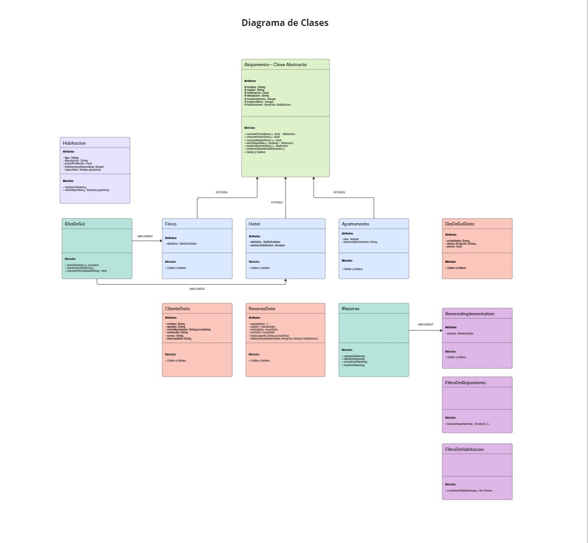

# 🏩 Book Stay
[](#)<br><br>

## Tabla de Contenidos
- [Descripción](#descripción)
- [Características](#características)
- [Tecnologías](#tecnologías)
- [Instalación y Configuración](#instalación-y-configuración)
- [Arquitectura y Funcionalidad](#arquitectura-y-funcionalidad)
- [Principales Métodos](#principales-métodos)
- [Limitaciones](#limitaciones)
- [Contacto](#contacto)

## Descripción
**Book Stay** es un programa de gestión de reservas desarrollado en  **Java 17 con Gradle**, que permite a los usuarios buscar, reservar, consultar y modificar reservas en hoteles y otros alojamientos turísticos. Diseñado para ejecutarse en consola, este sistema simula la funcionalidad básica de un sistema de reservas.

## Características
- **Buscar alojamiento**: Permite realizar búsquedas por ciudad, tipo de alojamiento, fechas, cantidad de personas y número de habitaciones necesarias.
- **Confirmar datos de reserva**: Muestra información detallada del alojamiento seleccionado y permite al usuario escoger el tipo y la cantidad de habitaciones en caso de tratarse de un hotel.
- **Realizar reserva**: Registra los datos del usuario y la selección de habitaciones para confirmar la reserva.
- **Consultar reservas**: Busca y muestra las reservas realizadas por un usuario mediante su correo electrónico y fecha de nacimiento.
- **Modificar reserva**: Permite cambiar el tipo o la cantidad de habitaciones reservadas, o cancelar una reserva existente.

## Tecnologías
- **Java JDK 17**
- **Gradle**: Herramienta para la construcción y gestión del proyecto.
- **Java Collections**: Uso de listas para simular la gestión de datos en memoria.

## Instalación y Configuración
1. **Clona el Repositorio:**
   ```bash
   git clone https://github.com/KJRM20/03-refactorizacion.git
   ```
2. **Compila y ejecuta el proyecto:**
    - Abre el proyecto en tu IDE y ejecuta la clase principal ```Main```.
    - Alternativamente, usa Gradle desde la línea de comandos:
      ```bash
      gradle run
      ```
3. **Interactúa con el sistema:**
    - Sigue las instrucciones que se presentan en la consola para realizar las operaciones disponibles.

## Arquitectura y Funcionalidad
El proyecto está organizado en una estructura simple basada en POO que simula una base de datos en memoria.


[Enlace del diagrama](https://miro.com/app/board/uXjVL1kQPPQ=/?share_link_id=557759462022)

### Datos Simulados
- **Alojamientos**:
    - Se almacena información de hoteles, apartamentos, fincas y días de sol.
    - Cada alojamiento tiene atributos como nombre, ciudad, categoría, precio, habitaciones disponibles y detalles adicionales.
- **Reservas**:
    - Cada reserva incluye datos personales del usuario, el tipo de alojamiento, las fechas de inicio y fin, y las habitaciones seleccionadas.

## Principales Métodos
- ```searchLodgings```: Filtra los alojamientos según los parámetros proporcionados.
- ```makeReservation```: Registra una nueva reserva en la lista de reservas.
- ```consultReservations```: Recupera y muestra reservas existentes según los datos del usuario.
- ```modifyReservation```: Permite cambiar habitaciones o cancelar una reserva.

## Limitaciones
- Los datos se gestionan en memoria, por lo que no persisten después de cerrar el programa.
- Las operaciones están diseñadas para un entorno de consola, sin interfaz gráfica ni integración con bases de datos.

## Contacto
Para preguntas, problemas o colaboraciones, por favor, contáctame.

-----

¡Gracias por tu interés en este booking de alojamientos! 🎉
<br><small>Realizado por Karen Rincón, 2024</small><br><br>
[](https://github.com/KJRM20)
[](https://www.linkedin.com/in/karen-rincon/) 